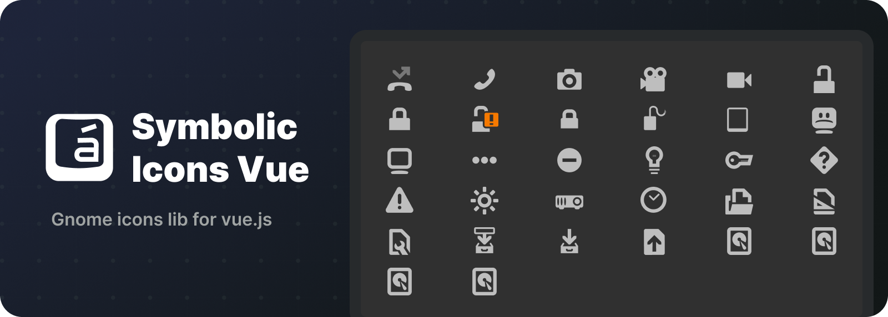

<div align="center">
  <p align="center">
    <a href="#">
      
    </a>
  </p>
</div>

<p align="center">
  <strong>GNOME Symbolic Icons for Vue 3</strong>
</p>

<p align="center">
  A complete collection of GNOME symbolic icons packaged as Vue 3 components with TypeScript support.
</p>

<p align="center">
  <a href="#installation">Installation</a> •
  <a href="#usage">Usage</a> •
  <a href="#features">Features</a> •
  <a href="#icon-gallery">Gallery</a> •
  <a href="#contributing">Contributing</a>
</p>

---

## 📦 Installation

Install the package using your preferred package manager:

```bash
npm install symbolic-icons
```

```bash
yarn add symbolic-icons
```

```bash
pnpm add symbolic-icons
```

```bash
bun add symbolic-icons
```

## 🚀 Usage

### Basic Usage

Import and use icons directly in your Vue 3 components:

```vue
<script setup lang="ts">
import { AlarmSymbolic, FolderSymbolic, StarredSymbolic } from 'symbolic-icons'
</script>

<template>
  <div>
    <AlarmSymbolic :size="32" />
    <FolderSymbolic :size="48" color="#1a73e8" />
    <StarredSymbolic :size="24" :opacity="0.8" />
  </div>
</template>
```

### Props

All icon components accept the following props:

| Prop | Type | Default | Description |
|------|------|---------|-------------|
| `size` | `number` | `16` | Icon size in pixels |
| `color` | `string` | `currentColor` | Icon color (any valid CSS color) |
| `opacity` | `number` | `1` | Icon opacity (0 to 1) |

### TypeScript Support

Full TypeScript support with type definitions included:

```typescript
import type { SymbolicIconsProps } from 'symbolic-icons'
import { AlarmSymbolic } from 'symbolic-icons'

const iconProps: SymbolicIconsProps = {
  size: 32,
  color: '#000000',
  opacity: 1
}
```

## ✨ Features

- 🎨 **386+ icons** - Complete GNOME symbolic icon set
- 🔧 **Vue 3 native** - Built specifically for Vue 3 with Composition API
- 📘 **TypeScript** - Full type definitions included
- 🎯 **Tree-shakeable** - Only import what you need
- 🎨 **Customizable** - Size, color, and opacity props
- ⚡ **Lightweight** - Optimized SVG output
- 🔍 **Searchable** - Interactive gallery to find icons

## 🎨 Icon Gallery

Browse all available icons in the interactive gallery:

🔗 **[View Icon Gallery](https://your-gallery-url.com)**

Or run the gallery locally:

```bash
git clone https://github.com/Cleboost/symbolic-icons.git
cd symbolic-icons
bun install
bun run build
cd gallery
bun install
bun run dev
```

## 📚 Icon Categories

Icons are organized into categories:

- **Actions** - Common UI actions (copy, paste, delete, etc.)
- **Apps** - Application icons
- **Devices** - Hardware and device icons
- **Emblems** - Status and badge icons
- **Faces** - Emoji-style face icons
- **Folders** - File system icons
- **Network** - Connectivity and network icons
- **Status** - System status indicators
- **Weather** - Weather condition icons

## 🛠️ Development

### Prerequisites

- [Bun](https://bun.sh/) (recommended) or Node.js 18+
- Vue 3.3+

### Setup

```bash
# Clone the repository
git clone https://github.com/Cleboost/symbolic-icons.git
cd symbolic-icons

# Install dependencies
bun install

# Download latest GNOME icons
bun run download

# Generate Vue components
bun run generate

# Build the package
bun run build
```

### Scripts

| Command | Description |
|---------|-------------|
| `bun run download` | Download latest GNOME symbolic icons |
| `bun run generate` | Generate Vue components from SVG files |
| `bun run build` | Build the package for distribution |
| `bun run clean` | Clean generated files |
| `bun run typecheck` | Run TypeScript type checking |
| `bun run lint` | Lint the codebase |

## 📄 License

This project is licensed under the [MIT License](./LICENSE).

The GNOME icons are licensed under the [CC BY-SA 3.0](https://creativecommons.org/licenses/by-sa/3.0/) license.

## 🙏 Credits

- Icons by [GNOME Project](https://gitlab.gnome.org/GNOME/adwaita-icon-theme)
- Vue 3 wrapper by [Cleboost](https://github.com/Cleboost)

---

<p align="center">
  Made with ❤️ for the Vue community
</p>

